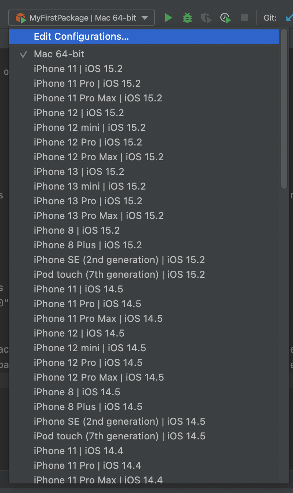
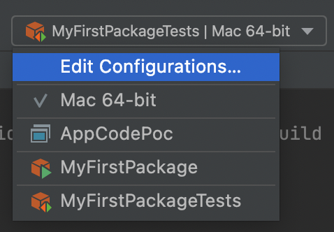

# AppCodePOC

Based on this tweet: https://twitter.com/stefanwalkner/status/1493906283778514948

If you choose `MyFirstPackageTests` in the upper right, there's only the option to choose Mac 64-bit as a platform, no iOS simulator. They are only available for the default `MyFirstPackage` target. I'm on an M1, AppCode 2021.3.2.

<h3>Working for normal target</h3>

<h3>But not for test target</h3>

